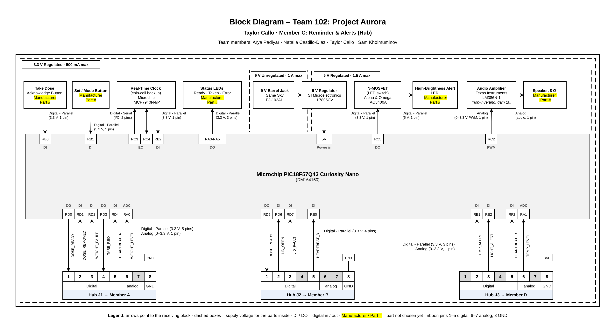

# Block Diagram

**Team 102 – Project Aurora** · Taylor Callo · Member C: Reminder & Alerts (Hub)

My board is the hub of our hub-and-spoke system. It keeps the dose schedule with a real-time clock, gives sound and light reminders, and talks to the three sensing boards (Weight, Cap / Lid, Storage Environment) over three 8-pin ribbon cables.

**Figure 1:** Individual block diagram for the Reminder & Alerts hub board. Click the image to enlarge it.

## Power Supplies

| Supply | Regulated? | Max current | Source | Powers |
|---|---|---|---|---|
| 9 V | No | 1 A | 9 V wall adapter into a Same Sky PJ-102AH barrel jack | 5 V regulator input |
| 5 V | Yes | 1.5 A | STMicroelectronics L7805CV | Curiosity Nano, LM386N-1 audio amp, alert LED through the AO3400A MOSFET |
| 3.3 V | Yes | 500 mA | Curiosity Nano on-board regulator | PIC18F57Q43, real-time clock, buttons, status LEDs, ribbon-cable signals |

## Major Components

| Block | Manufacturer | Part number | Notes |
|---|---|---|---|
| Microcontroller board | Microchip | PIC18F57Q43 Curiosity Nano (DM164150) | Required by the course |
| Barrel jack | Same Sky | PJ-102AH | 9 V input |
| 5 V regulator | STMicroelectronics | L7805CV | Linear regulator |
| Real-time clock | Microchip | MCP7940N-I/P | I²C, coin-cell backup, alarm output |
| Audio amplifier | Texas Instruments | LM386N-1 | Non-inverting, gain 20 |
| Speaker, 8 Ω | TBD | TBD | Driven by the LM386 |
| N-channel MOSFET | Alpha & Omega Semiconductor | AO3400A | Switches the alert LED |
| High-brightness alert LED | TBD | TBD | 5 V side, switched by the MOSFET |
| Status LEDs (Ready, Taken, Error) | TBD | TBD | Driven from RA3–RA5 |
| Push buttons (Take Dose, Set / Mode) | TBD | TBD | Inputs on RB0 and RB1 |

## Microcontroller Pin Use

| Pin(s) | Peripheral | Connects to | Signal |
|---|---|---|---|
| RB0 | DI | Take Dose / Acknowledge button | Digital - Parallel (3.3 V, 1 pin) |
| RB1 | DI | Set / Mode button | Digital - Parallel (3.3 V, 1 pin) |
| RC3, RC4 | I2C | Real-time clock (SCL, SDA) | Digital - Serial (I²C, 2 pins) |
| RB2 | DI | Real-time clock alarm (MFP) | Digital - Parallel (3.3 V, 1 pin) |
| RA3–RA5 | DO | Status LEDs | Digital - Parallel (3.3 V, 3 pins) |
| RC5 | DO | AO3400A MOSFET gate | Digital - Parallel (3.3 V, 1 pin) |
| RC2 | PWM | LM386N-1 input | Analog (0–3.3 V PWM, 1 pin) |
| RD0–RD4, RA0 | DO / DI / ADC | J1 → Weight board | Digital - Parallel (3.3 V, 5 pins), Analog (0–3.3 V, 1 pin) |
| RD5–RD7, RE0 | DO / DI | J2 → Cap / Lid board | Digital - Parallel (3.3 V, 4 pins) |
| RE1, RE2, RF2, RA1 | DI / ADC | J3 → Environment board | Digital - Parallel (3.3 V, 3 pins), Analog (0–3.3 V, 1 pin) |

## Ribbon Cable Signals

| Cable | Pin | Signal | Direction | Hub pin |
|---|:-:|---|---|:-:|
| J1 (Weight) | 1 | DOSE_READY | Hub → Weight | RD0 |
| J1 (Weight) | 2 | DOSE_REMOVED | Weight → Hub | RD1 |
| J1 (Weight) | 3 | WEIGHT_FAULT | Weight → Hub | RD2 |
| J1 (Weight) | 4 | TARE_REQ | Hub → Weight | RD3 |
| J1 (Weight) | 5 | HEARTBEAT_A | Weight → Hub | RD4 |
| J1 (Weight) | 6 | WEIGHT_LEVEL | Weight → Hub | RA0 |
| J2 (Cap / Lid) | 1 | DOSE_READY | Hub → Cap | RD5 |
| J2 (Cap / Lid) | 2 | LID_OPEN | Cap → Hub | RD6 |
| J2 (Cap / Lid) | 3 | LID_FAULT | Cap → Hub | RD7 |
| J2 (Cap / Lid) | 5 | HEARTBEAT_B | Cap → Hub | RE0 |
| J3 (Environment) | 2 | TEMP_ALERT | Env. → Hub | RE1 |
| J3 (Environment) | 3 | LIGHT_ALERT | Env. → Hub | RE2 |
| J3 (Environment) | 5 | HEARTBEAT_D | Env. → Hub | RF2 |
| J3 (Environment) | 6 | TEMP_LEVEL | Env. → Hub | RA1 |

Pin 8 on every cable is ground, and unused pins are spare. The full cable tables are on our [team block diagram page](https://asu-egr304-2026-f-102.github.io/06-team-block-diagram/).
